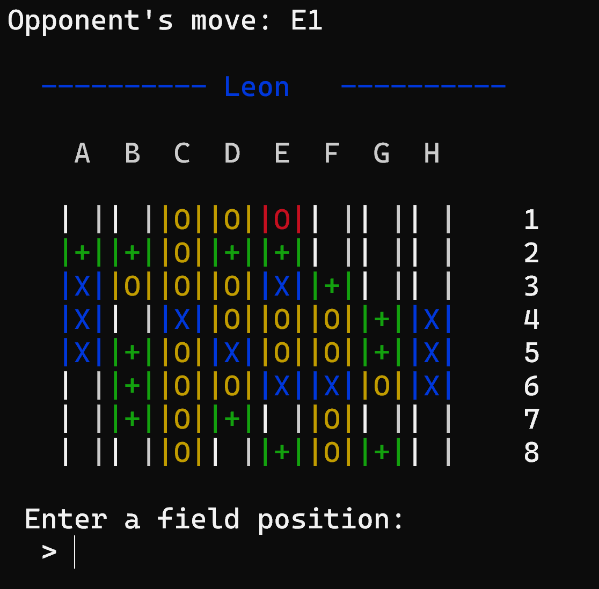
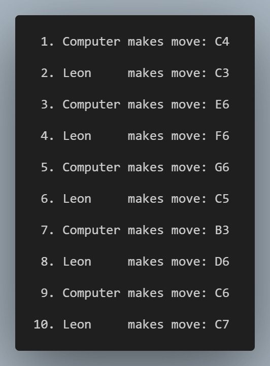

# ReversiConsole
A strategy game [Reversi](https://en.wikipedia.org/wiki/Reversi) as a console application with 
move validation, logging of the game progress in a log file, and a computer opponent.
It can be played player versus player or against a computer opponent.


## How to play
1. Clone the repository
2. In the project root, run:
    ```shell
    mkdir build
    cd build
    cmake ..
    make
    ./ReversiConsole
    ```
3. Follow the instructions on the screen to play the game.
## Screenshots

