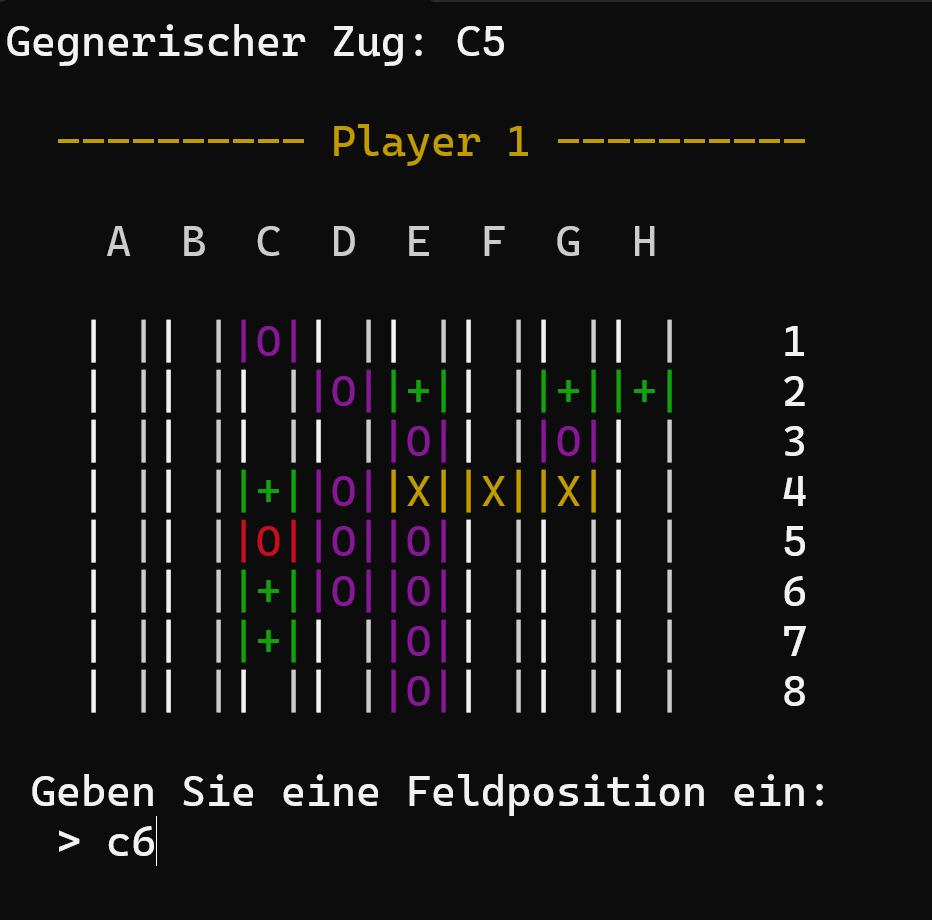
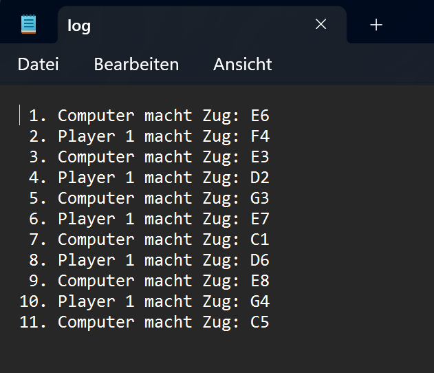

# ReversiConsole
Strategiespiel [Reversi](https://en.wikipedia.org/wiki/Reversi) als Konsolenanwendung mit 
Zugüberprüfung auf Korrektheit, Ausgabe des Spielverlaufs in einer Log-Datei und Computergegner.
Es kann Spieler gegen Spieler oder gegen einen Computergegner gespielt werden.

